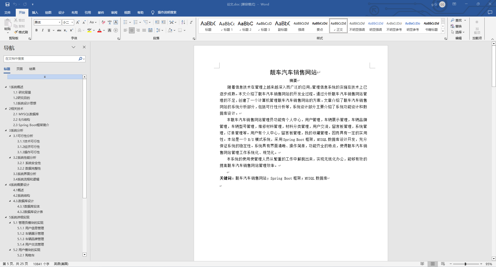
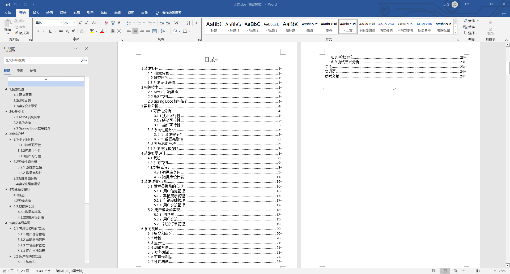
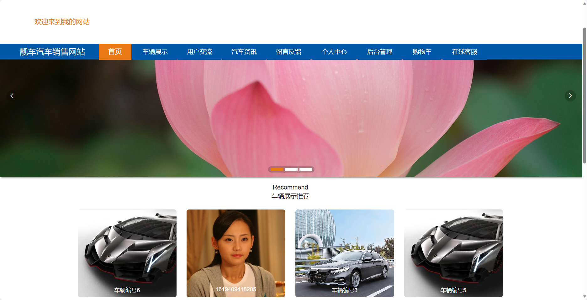
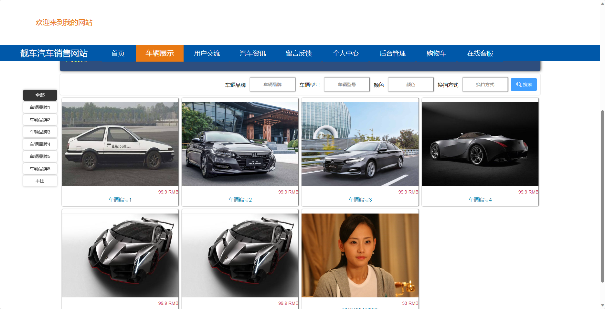
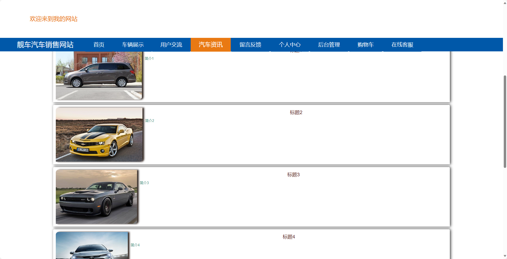
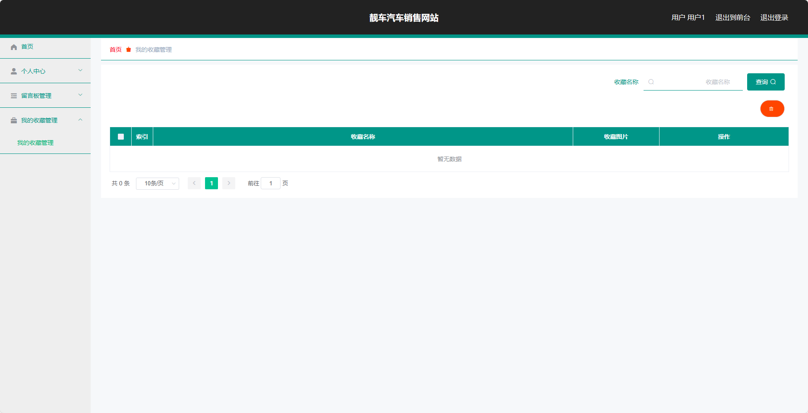
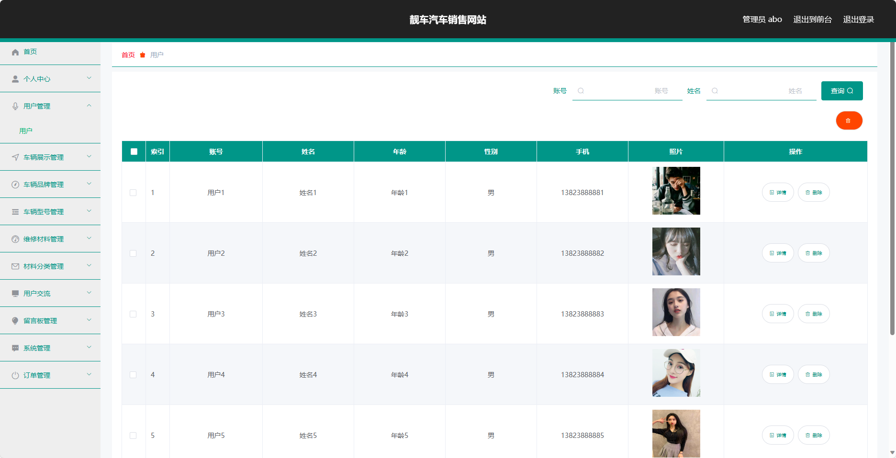
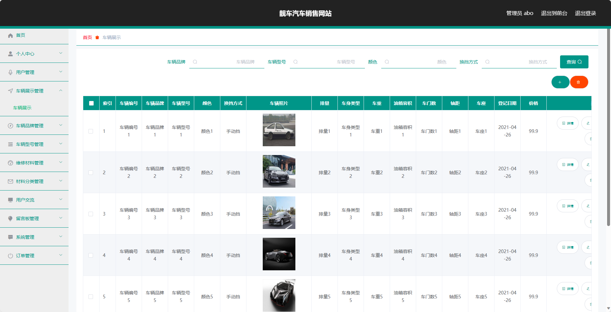

基于SpringBoot的靓车汽车销售网站（程序+论文）
=
- 完整代码获取地址：从戎源码网 ([https://armycodes.com/](https://armycodes.com/))
- 作者微信：19941326836  QQ：952045282 
- 承接计算机毕业设计、Java毕业设计、Python毕业设计、深度学习、机器学习
- 选题+开题报告+任务书+程序定制+安装调试+论文+答辩ppt 一条龙服务

一、项目介绍
---
基于Spring Boot框架实现的靓车汽车销售网站，系统包含两种角色：管理员、用户,系统分为前台和后台两大模块，主要功能如下。

### 前台功能简介：
- 首页：展示网站的概要信息和推荐车辆。
- 车辆展示：展示可供销售的汽车。
- 用户交流：提供用户之间的交流平台。
- 汽车资讯：提供关于汽车行业的最新资讯和相关文章。
- 留言反馈：用户可以留下对于网站或车辆的反馈和建议。
- 个人中心：用户可以管理个人信息、查看订单状态以及管理个人收藏。

### 后台功能简介：
### 用户角色：
- 个人中心：用户可以管理个人信息和修改密码等。
- 留言板管理：管理员可以管理用户留言的审核和回复。
- 我的收藏管理：用户可以查看和管理自己收藏的车辆信息。

### 管理员角色：
- 个人中心：管理员可以管理个人信息和修改密码等。
- 用户管理：管理员可以对用户进行管理，
- 车辆展示管理：管理员可以管理车辆的展示信息，
- 车辆品牌管理：管理员可以管理车辆品牌的信息，
- 车辆型号管理：管理员可以管理车辆型号的信息，
- 维修材料管理：管理员可以管理维修材料的信息，
- 材料分类管理：管理员可以管理材料的分类信息，
- 用户交流留言板管理：管理员可以管理用户之间交流的留言板，。
- 系统管理：管理员可以管理系统的基本设置，
- 订单管理：管理员可以管理用户的订单信息，

### 其他功能：
- 购物车：用户可以将感兴趣的车辆加入购物车并进行管理。
- 在线客服：提供在线客服支持。

二、项目技术
---
- 编程语言：Java
- 数据库：MySQL
- 项目管理工具：Maven
- 前端技术：VUE、HTML、Jquery、Bootstrap
- 后端技术：Spring、SpringMVC、MyBatis

三、运行环境
---
- 操作系统：Windows、macOS都可以
- JDK版本：JDK1.8以上都可以
- 开发工具：IDEA、Ecplise、Myecplise都可以
- 数据库: MySQL5.7以上都可以
- Tomcat：任意版本都可以
- Maven：任意版本都可以

四、运行截图
---
### 论文截图：

### 程序截图：

